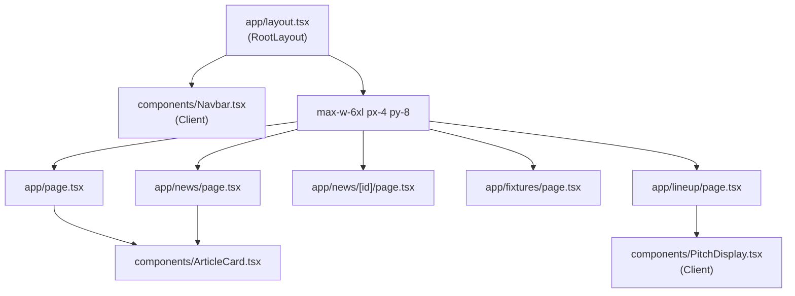

# Design Document

## Feature: news-site-responsive-design

---

## Overview

This feature makes the Izinja Ze Game FC news site fully responsive across three breakpoints using Tailwind CSS utility classes. The site already uses Tailwind v4 and Next.js 16, so no new dependencies are required. The work is purely additive — replacing or augmenting existing class strings in the five pages, three components, and root layout.

Tailwind breakpoints used throughout:
- **Mobile**: default (no prefix) — `< 640px`
- **Tablet**: `sm:` — `≥ 640px`
- **Desktop**: `lg:` — `≥ 1024px`

The approach is **mobile-first**: base classes target mobile, `sm:` overrides target tablet, `lg:` overrides target desktop.

---

## Architecture

The site is a Next.js App Router application. All pages are React Server Components; `Navbar` and `PitchDisplay` are Client Components (`'use client'`). Styling is done exclusively with Tailwind CSS utility classes — there is no separate CSS module layer to maintain.

Because all layout is Tailwind-driven, every responsive change is isolated to the JSX class strings in each file. No shared state or new API routes are needed.

---

## Components and Interfaces

### Navbar (`components/Navbar.tsx`)

Current issues:
- Club name `hidden sm:block` is already correct.
- Nav links use `px-3 py-2` — touch targets may be under 44px on mobile.
- No overflow protection if viewport is very narrow.

Changes:
- Ensure the `<nav>` inner container uses `flex items-center justify-between` with `gap-2` and `flex-wrap` as a safety net.
- Nav link touch targets: add `min-h-[44px] min-w-[44px]` or equivalent padding (`py-3 px-3`) so each link meets the 44×44 CSS pixel minimum.
- Logo area: already shows abbreviated "IZG" mark on all sizes; full name hidden below `sm`.

### ArticleCard (`components/ArticleCard.tsx`)

Current issues:
- Featured mode uses `md:flex` — this is the `md` breakpoint (768px), but the spec uses `sm`/`lg`. Align to `lg:flex` for desktop row layout.
- Padding in featured mode uses `md:p-8` — change to `lg:p-8`.
- Badge row can overflow on very narrow screens — already uses `flex-wrap` in the article detail page but not in the card itself.

Changes:
- Featured layout: `lg:flex` (row on desktop, stacked on mobile/tablet).
- Featured padding: `lg:p-8`.
- Add `flex-wrap gap-1` to the badge container inside the card.

### PitchDisplay (`components/PitchDisplay.tsx`)

Current issues:
- Player token is `w-9 h-9` (36×36px) — below the 44px touch target guideline and the 28px minimum stated in requirements. At 36px it already meets the 28px minimum, but on very small screens the pitch scales down, making the token visually smaller.
- Token size is fixed in `rem`/`px` units, not responsive to pitch scale.
- Player name truncation already shows first name only (`p.name.split(' ')[0]`).

Changes:
- Use responsive token sizes: `w-7 h-7 sm:w-8 sm:h-8 lg:w-9 lg:h-9` — ensures minimum 28px on mobile.
- The pitch container already uses `w-full` and `style={{ aspectRatio: '7 / 10' }}` — this is correct and needs no change.
- Token font size: `text-[10px] sm:text-xs` for the number inside the token.

### Layout (`app/layout.tsx`)

The `<main>` wrapper uses `max-w-6xl mx-auto px-4 py-8`. Add responsive horizontal padding: `px-4 sm:px-6 lg:px-8` to give more breathing room on larger screens while keeping mobile compact.

---

## Data Models

No data model changes. All changes are presentational (Tailwind class strings). The underlying Supabase queries and TypeScript types remain unchanged.

---

## Page-Level Changes

### Home Page (`app/page.tsx`)

| Element | Mobile | Tablet (`sm:`) | Desktop (`lg:`) |
|---|---|---|---|
| Fixture banner | `flex-col` | `sm:flex-row` | — |
| News grid | `grid-cols-1` | `sm:grid-cols-2` | `lg:grid-cols-3` |
| Featured article | full width | full width | full width |

The fixture banner already has `flex-col sm:flex-row` — this is correct. The news grid already has `grid-cols-1 sm:grid-cols-2 lg:grid-cols-3` — also correct. The featured `ArticleCard` needs the `lg:flex` fix described above.

### News Listing Page (`app/news/page.tsx`)

The grid already uses `grid-cols-1 sm:grid-cols-2 lg:grid-cols-3` — correct. The heading `text-3xl` is fine on mobile. No changes needed beyond verifying the ArticleCard fix flows through.

### Article Detail Page (`app/news/[id]/page.tsx`)

- `max-w-3xl mx-auto` already constrains desktop width — correct.
- Title: `text-3xl sm:text-4xl` already present — correct.
- Badge row: `flex items-center gap-2 flex-wrap` already present — correct.
- Body: `prose prose-invert prose-lg` with `leading-relaxed` — correct for readability.
- No changes needed here beyond verifying the existing classes are sufficient.

### Fixtures Page (`app/fixtures/page.tsx`)

Current issues:
- `MatchRow` uses `flex items-center justify-between gap-4` — good structure.
- Team name `truncate` is already applied — correct.
- Sub-details (date, venue, competition) are on one `
` with `text-xs` — fine on mobile.
- Section heading `text-3xl` on the `<h1>` may be large on mobile — reduce to `text-2xl sm:text-3xl`.

Changes:
- `<h1>`: `text-2xl sm:text-3xl font-black text-white`.
- `MatchRow` sub-detail `
`: already `text-xs`, add `truncate` to prevent overflow on very long venue+competition strings.

### Lineup Page (`app/lineup/page.tsx`)

Current issues:
- `max-w-lg mx-auto` constrains the pitch to ~512px max — this is intentional for desktop but on mobile the `w-full` inside PitchDisplay already fills the container. The `max-w-lg` wrapper should be removed or widened so the pitch fills mobile screens.
- Player list grid: `grid-cols-2 gap-2` — needs to be `grid-cols-1 sm:grid-cols-2`.
- Match title: `text-2xl font-black` — fine on mobile.

Changes:
- Remove `max-w-lg mx-auto` wrapper (or change to `max-w-2xl`) so the pitch fills mobile width.
- Player list: `grid grid-cols-1 sm:grid-cols-2 gap-2`.

---

## Correctness Properties

*A property is a characteristic or behavior that should hold true across all valid executions of a system — essentially, a formal statement about what the system should do. Properties serve as the bridge between human-readable specifications and machine-verifiable correctness guarantees.*

### Property 1: Featured ArticleCard layout mode

*For any* ArticleCard rendered in `featured` mode, the component's root `<article>` element SHALL include the `lg:flex` class, and SHALL NOT include `md:flex`, ensuring the horizontal layout activates at the desktop breakpoint and not before.

**Validates: Requirements 7.2, 7.3**

---

### Property 2: News grid column classes present

*For any* page that renders an article grid (Home, News listing), the grid container SHALL carry all three column classes: `grid-cols-1`, `sm:grid-cols-2`, and `lg:grid-cols-3`, so that single/two/three column layouts are applied at the correct breakpoints.

**Validates: Requirements 2.3, 2.4, 2.5, 3.1, 3.2, 3.3**

---

### Property 3: Navbar full-name visibility class

*For any* render of the Navbar, the full club name element SHALL carry `hidden sm:block` (or equivalent), ensuring it is hidden on mobile and visible on tablet and above.

**Validates: Requirements 1.1, 1.2, 1.3**

---

### Property 4: Navbar link touch target size

*For any* navigation link rendered in the Navbar, the computed minimum height and width of the link element SHALL be at least 44 CSS pixels, satisfying touch target requirements.

**Validates: Requirements 1.6**

---

### Property 5: PitchDisplay aspect ratio preservation

*For any* viewport width, the PitchDisplay container SHALL maintain a 7:10 aspect ratio (width:height), so pitch markings remain proportionally correct regardless of the container's rendered width.

**Validates: Requirements 6.1, 8.1, 8.2**

---

### Property 6: PitchDisplay token minimum size

*For any* viewport width at or below 640px (mobile), the player number token inside PitchDisplay SHALL have a minimum rendered size of 28×28 CSS pixels.

**Validates: Requirements 6.5, 8.3**

---

### Property 7: Lineup player list column classes

*For any* render of the Lineup page player list grid, the container SHALL carry `grid-cols-1` as the base class and `sm:grid-cols-2` for tablet and above.

**Validates: Requirements 6.2, 6.3**

---

### Property 8: Fixture banner stacking direction

*For any* render of the Home page fixture banner, the flex container SHALL carry `flex-col` as the base class and `sm:flex-row` for tablet and above, ensuring stacked layout on mobile and row layout on wider screens.

**Validates: Requirements 2.1, 2.2**

---

## Error Handling

This feature involves no new data fetching, API calls, or state mutations. Error handling considerations are limited to:

- **Missing Tailwind classes**: If a responsive class is omitted, the layout silently falls back to the base (mobile) style. This is a visual regression, not a runtime error. The testing strategy (snapshot and property tests) catches this.
- **PitchDisplay with zero players**: Already handled upstream — the Lineup page returns an empty state before rendering `PitchDisplay`. No change needed.
- **Very long strings (team names, article titles)**: Handled by `truncate` and `line-clamp-3` utilities. The design specifies where these must be applied.

---

## Testing Strategy

### Dual Testing Approach

Both unit/example tests and property-based tests are used. They are complementary:
- **Unit tests** verify specific rendered outputs and edge cases.
- **Property tests** verify that structural invariants hold across all component configurations.

### Testing Stack

The news-site has no test framework installed. The standard choice for Next.js + TypeScript is:
- **Test runner**: [Vitest](https://vitest.dev/) — fast, native ESM, compatible with Next.js.
- **Component rendering**: [@testing-library/react](https://testing-library.com/docs/react-testing-library/intro/) with `@testing-library/jest-dom` matchers.
- **Property-based testing**: [fast-check](https://fast-check.dev/) — the leading PBT library for TypeScript/JavaScript.

### Unit Tests

Focus on specific examples and edge cases:

- `Navbar` renders abbreviated logo on all sizes; full name has `hidden sm:block`.
- `ArticleCard` in featured mode renders with `lg:flex` class.
- `ArticleCard` in non-featured mode does NOT render with `lg:flex`.
- `PitchDisplay` renders with `w-full` and `style={{ aspectRatio: '7 / 10' }}`.
- `PitchDisplay` with a player whose name is "John Smith" renders only "John" as the display name.
- `FixturesPage` `MatchRow` renders team name with `truncate` class.
- `LineupPage` player list grid has `grid-cols-1 sm:grid-cols-2`.

### Property-Based Tests

Each property test runs a minimum of 100 iterations. Each test is tagged with the design property it validates.

**Feature: news-site-responsive-design, Property 1: Featured ArticleCard layout mode**
- Generate arbitrary article objects and `featured = true`.
- Assert the rendered `<article>` element's className contains `lg:flex` and does not contain `md:flex`.

**Feature: news-site-responsive-design, Property 2: News grid column classes present**
- Generate arrays of 0–20 arbitrary article objects.
- Render the news grid container.
- Assert className contains `grid-cols-1`, `sm:grid-cols-2`, and `lg:grid-cols-3`.

**Feature: news-site-responsive-design, Property 3: Navbar full-name visibility class**
- Render Navbar with arbitrary pathname strings.
- Assert the full club name element has className matching `/hidden sm:block/` (or equivalent).

**Feature: news-site-responsive-design, Property 4: Navbar link touch target size**
- Render Navbar and query all `<a>` elements inside the `<ul>`.
- Assert each link has padding classes that produce at least 44px height/width (verify class presence: `py-3` or `min-h-[44px]`).

**Feature: news-site-responsive-design, Property 5: PitchDisplay aspect ratio preservation**
- Generate arrays of 0–11 arbitrary player objects.
- Render PitchDisplay.
- Assert the pitch container element has `style.aspectRatio === '7 / 10'` or equivalent inline style.

**Feature: news-site-responsive-design, Property 6: PitchDisplay token minimum size**
- Generate arbitrary player objects.
- Render PitchDisplay.
- Assert each token element's className contains `w-7` (28px) as the base (mobile) size class.

**Feature: news-site-responsive-design, Property 7: Lineup player list column classes**
- Generate arrays of 0–11 arbitrary player objects.
- Render the player list grid.
- Assert className contains `grid-cols-1` and `sm:grid-cols-2`.

**Feature: news-site-responsive-design, Property 8: Fixture banner stacking direction**
- Render the fixture banner with arbitrary match data.
- Assert the flex container className contains `flex-col` and `sm:flex-row`.
